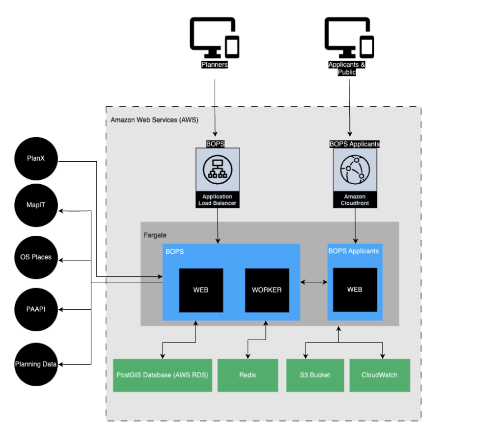

# BOPS 

[Home](../README.md) | [BOPS Applicants](https://github.com/unboxed/bops-applicants/)

## BOPS FAQs

### What is BOPS and what can it do?
The Back-Office Planning System is part of the [Open Digital Planning Community (ODP)](https://opendigitalplanning.org/), a movement to build the next generation of planning services in local government.

BOPS was conceived by a team of forward-thinking councils to transform the way that planning applications are processed. They wanted a back-office planning system that would:

- make planning data and records **easily accessible**
- **increase efficiency** across the planning application process
- **meet the needs of its users** - Planning Officers

Keep up to date with the latest ODP news and progress via our Show and Tell sessions, which can be viewed [here](https://www.youtube.com/@opendigitalplanning97/videos)

### What is the code in this repo?
The code is open-source and licensed under the [MIT License](https://en.wikipedia.org/wiki/MIT_License). The code required for deployment and hosting is in a separate repo, [BOPS infrastructure repo](https://github.com/unboxed/bops-terraform/), which is private.

### Where can I find technical information about how to get my local authority's planning team up and running on BOPS?
There is a BOPS handbook that provides a list of all the prerequisites and configuration instructions that are needed. To get access to this and to find out more information about the project, email [bops-team@unboxedconsulting.com](mailto:bops-team@unboxed.consulting.com)

### With what other services is BOPS integrated?
BOPS is integrated with:

- [PlanX](https://www.planx.uk/)
    - to receive data-rich applications
    - to **query site constraints** throughout the life of the application
- [GOV.UK](http://GOV.UK) Notify
    - for easy consultation
- [GOV.UK](http://GOV.UK) Pay
    - for quick and easy payment processing
- Planning Portal (in progress)

### What does the architecture look like?

Here is a very high-level view of how BOPS works:

### Where can I find out more about terms that are used in the planning process?
Here is a helpful [glossary](https://opensystemslab.notion.site/Glossary-of-planning-terms-8c61da556dfb45d4a53c34a03f249994) of commonly used planning terms.
